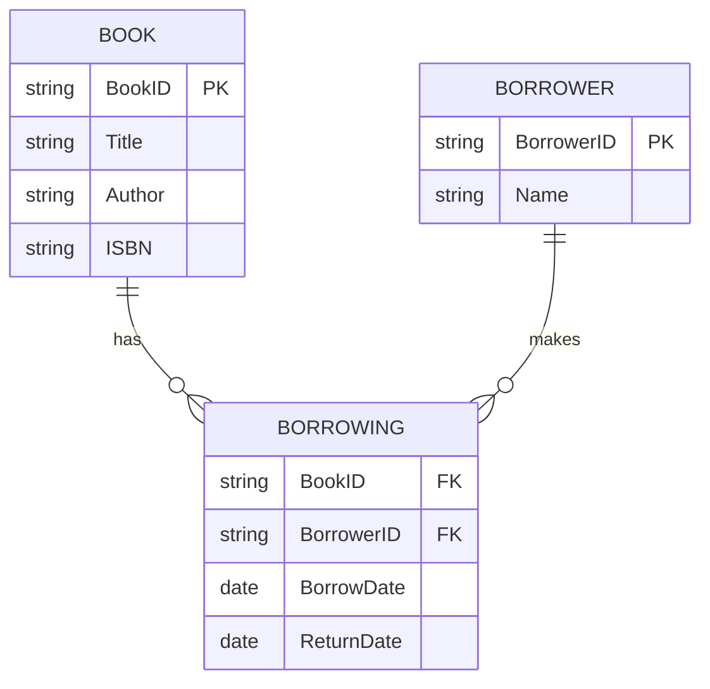
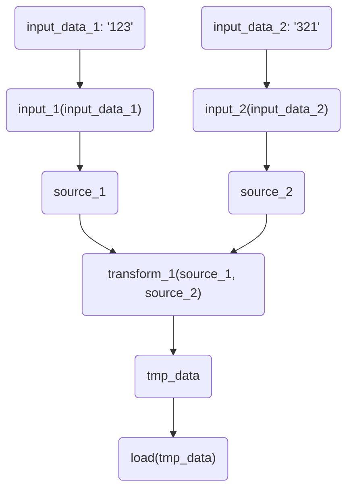

```mermaid
erDiagram
    BOOK ||--o{ BORROWING : "has"
    BORROWER ||--o{ BORROWING : "makes"
    BOOK {
        string BookID PK
        string Title
        string Author
        string ISBN
    }
    BORROWER {
        string BorrowerID PK
        string Name
    }
    BORROWING {
        string BookID FK
        string BorrowerID FK
        date BorrowDate
        date ReturnDate
    }

```

```mermaid
flowchart TD
    input_data_1("input_data_1: '123'") --> input_1
    input_data_2("input_data_2: '321'") --> input_2
    input_1("input_1(input_data_1)") --> source_1("source_1")
    input_2("input_2(input_data_2)") --> source_2("source_2")
    source_1 --> transform_1
    source_2 --> transform_1
    transform_1("transform_1(source_1, source_2)") --> tmp_data("tmp_data")
    tmp_data --> load("load(tmp_data)")

```